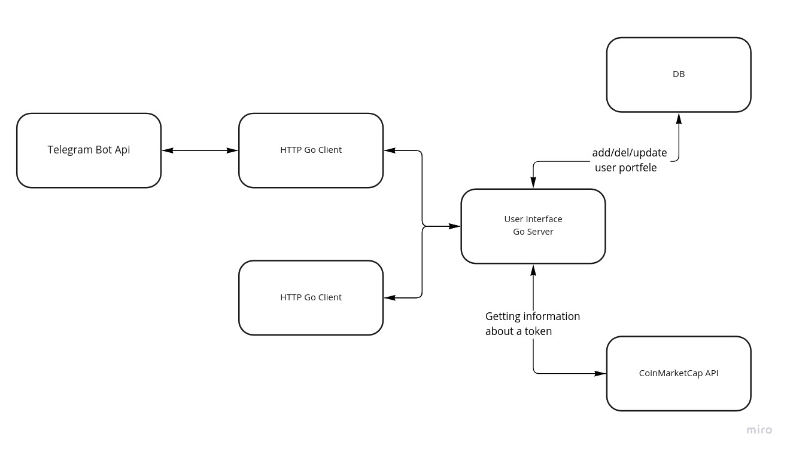

# Бот - узнать цену акции

## Концепция
Бот, который выдает текущий курс определенной акции на основе данных из API Тинькофф'а. Так же умеет выдавать инфу об акции по тикеру

Схема в schema.png

## Логика
### Узнать курс акции
* Пишет в ТГ тикер акции
* Запрос по grpc идет на сервер
* После этого так же по grpc запрашивает данные о акции у Тинькоффа
* Записываем к себе в базу
* Отдаем результат

### Схема архитектуры приложения:

